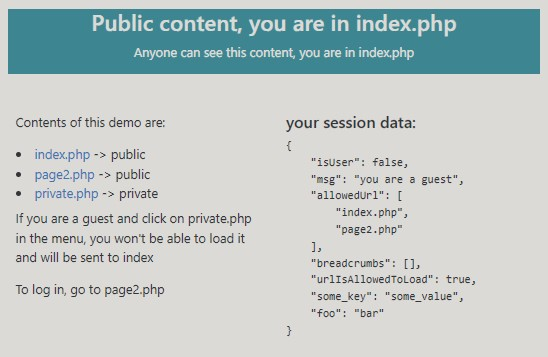
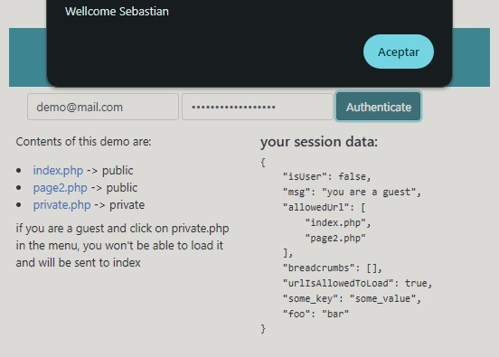
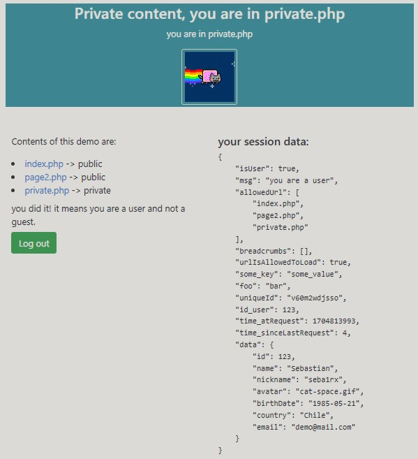

# SessionManager
Simple PHP session manager implementing security against hijacking

Requires PHP 8

install with `composer require seba1rx/sessionadmin`

Usage:

On each PHP page, call `activateSession()` method as you would with `session_start()`

### In order to use this class, you can use the Seba1rx\MySessionAdmin class or you can create your own class to extend Seba1rx\SessionAdmin Class

There are 2 public methods:

`activateSession()` and `createUserSession()`

You will find a working demo in `/demo` , the demo shows a basic website implementing the class, or you can clone this repo to your local dev environment to try out the demo.

This class can be useful in websites that have public content available but also restricted content accessible only if you log in

Features:
- Creates a session for guest and users
- Named session
- 3% chances of regenerating session id on each request to prevent session fixation
- Prevents hijacking
- session destruction on obsolete request
- proxy-aware ip detection
- Optional: Define allowed URL array for guests, that can be expanded when user logs in according to system profile


### Here are some screen caps:







### Here is a demo authenticator

```
require('../vendor/autoload.php');

use Seba1rx\MySessionAdmin;

$rxSessionAdmin = new MySessionAdmin(
    [
        "sessionLifetime" => 3600,
        "allowedURLs" => ["index.php", "page2.php"],
        "keys" => [
            "some_key" => "some_value",
            "foo" => "bar",
        ],
   ]
);
$rxSessionAdmin->activateSession();

// this scripts simulates an authentication, you should implement your own validation

$validationResponse = [
    'ok' => false,
    'msg' => null,
];


if(
    isset($_POST["useremail"]) && !empty($_POST["useremail"]) && isset($_POST["userpassword"]) && !empty($_POST["userpassword"])
    // no other validation so you can use any user/email in this demo
){
    // lets assume we query the system database and the data matching the credentials is the following
    $data = [
        "id" => 123,
        "name" => "Sebastian",
        "nickname" => "seba1rx",
        "avatar" => "cat-space.gif",
        "birthDate" => "1985-05-21",
        "country" => "Chile",
        "email" => $_POST["useremail"]
    ];

    // up to now we are in guest mode... lets call the method to create the user session
    $rxSessionAdmin->createUserSession($data['id']);

    // since $_SESSION is open, there is no point in encapsulating the data with get and set... lets add the data to SESSION['data']
    foreach($data AS $dataName => $dataValue){
        $_SESSION['data'][$dataName] = $dataValue;
    }

    // here you woud iterate to add allowed urls according to assigned profile
    // foreach($ProfileAllowedUrls AS $url){
    //    $_SESSION['allowedUrl'][] = $url;
    // }

    $validationResponse['ok'] = true;
    $validationResponse['msg'] = 'Wellcome '.$_SESSION['data']['name'];

}else{
    $validationResponse['ok'] = false;
    $validationResponse['msg'] = 'Complete the form fields!';
}

echo json_encode($validationResponse);

```
