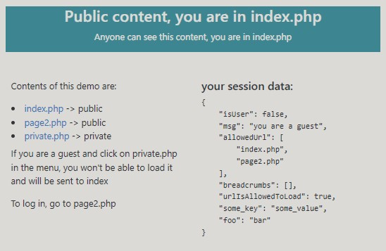
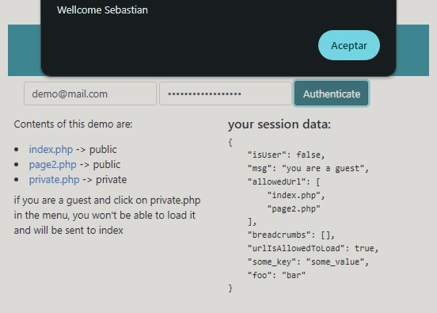
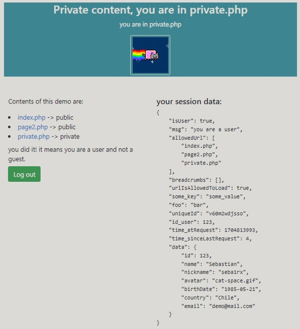

# MPA: Multi Page Application demo

In a MPA website you have multiple pages, for instance:

* index.php -> public
* products.php -> public
* contact_us.php -> public
* admin_pannel.php -> private

In this demo you have 3 "app" pages:

+ index.php -> public
+ pade2.php -> public
+ private.php -> private

You can see an implementation of the SessionAdmin class in the file MyMPASessionAdmin.php

You will see that on each page the file "required.php" is included at the top, since that file starts the session.

### Here are some screen caps:

